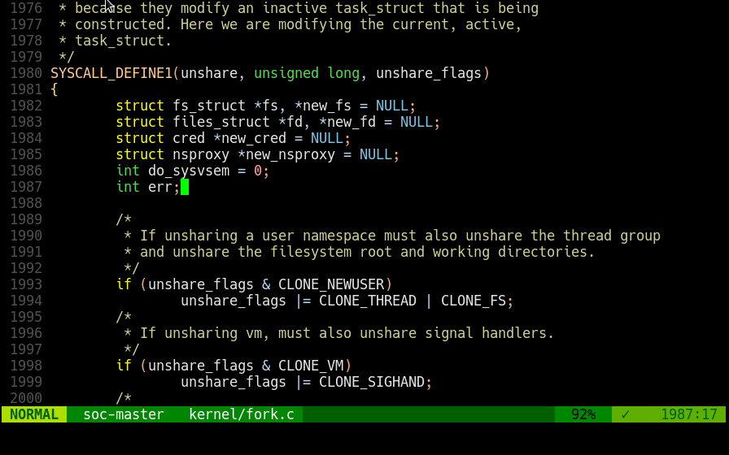

# name-assign.vim

## Short introduction

This repository provides a Vim plugin to automate replacing expressions with
assigned variables in multiple programming language.

An animated Gif is worth a 1,000 words:




## Description

In many programming languages, a common editing operation is to move subexpressions
out of a nested expression into their own assigned names.

To illustrate, suppose we want to transform the following:

    call_func(some_code, some_complex_and_long_expression);

Into the following:

	let var = some_complex_and_long_expression;
	...
    call_func(some_code, var);

There can be any amount of lines between the top expression and the variable
assignment.

The plugin supports the following languages;

* Rust
* C/C++
* VimScript
* JavaScript
* Python


## Usage instructions

First, note that the default kbd combination is <kbd>Alt</kbd> - <kbd>=</kbd>, and it is bound in visual mode.

Each usage has four steps:

* Mark the expression to replace with a visual selection.
* Hit the key combination, pick the name of the expression.
* Now in 'placement mode', move the assignment expression with <kbd>Up</kbd> or <kbd>Down</kbd>, or using <kbd>k</kbd> or <kbd>j</kbd>.
* End placing the assignment with <kbd>Esc</kbd> or <kbd>Return</kbd>.

### Overriding mappings

The trigger to activate can be set to a different key:

```
vmap <leader>b <Plug>NameAssign
```

It is also possible to override mappings done for the placement mode to
different keys, for example:

```
let g:name_assign_mode_maps = { "up" : ["n"],  "down" : ["N"] }
```

These mappings are temporary and buffer local, so they will not affect any
global mappings for the specified keys.

Here's the full list of actions:

* `up` : For moving the placement up
* `down` : For moving the placement down
* `settle` : For ending placement

## TODO

* Extend support to more languages.
